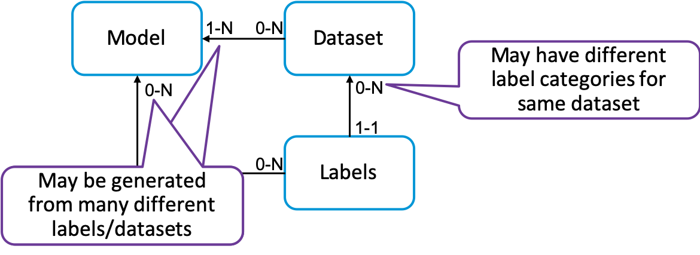

# ml-git : a Distributed Version Control System for  #

## Context ##

One of the major  engineer challenge is to create projects enabling efficient collaboration from anyone within a team or across organizations.
A few questions to ask :
* How do you distribute your dataset? How do you evolve these datasets?
* How do you version a ML model?
* How do you exactly reproduce a specific ML model version?

Compared to legacy SW development, the challenge comes from 2 main reasons:
1. VCS are usually not made to keep versioning a elevated number (~Millions) of (sometimes large) binary files
2. it's not a simple code/text -> binary relationship. There is a more complex relationship between a set of, let's call them, ML entities as show in Figure 1.

|  |
|:--:|
| *ML entities* |

If one does not track exactly the version of a dataset, nobody will be able to reproduce a specific version of a ML model ... unless, the dataset is kept static/immutable. Unlikely to be a desirable property of a dataset in a  world.
If one cannot related a label set to a specific dataset version, you end with the same constraints.

Today, tt is so cumbersome to do that kind of dataset updates that most of public datasets are almost static. With the most active being updated once a year. Furthermore, since there is no version tracking system behind, there is no way for anyone to send, say, a pull request with new data. This is not a situation the worldwide  community wants to stay in.

## ml-git purpose ##

ml-git is a tool which aim is to provide a Distributed Version Control system to enable efficient  engineers collaboration. Like its name emphasizes, it is meant to be similar to git in mindset, concept and workflows.
More specifically, it should enable  engineers to
* version  engineers ML artefacts (dataset, labels, ...)
* distribute these ML artefacts between members of a team or across organizations
* apply the right data governance and security models to their artefacts

If done right, we should not only enable  engineers track versioning of ML entities (dataset, labels, ...), but also reproduce any experiment **and** enable easy updates of any (public) datasets.

