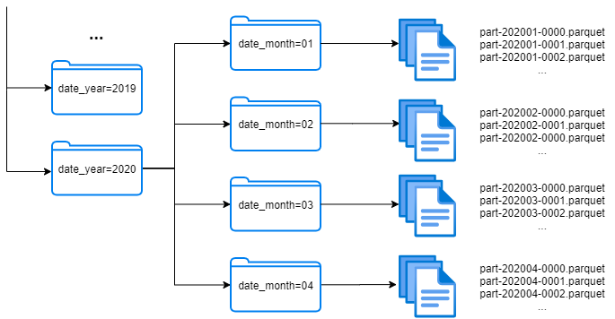

# Working with tabular data #

### <a name="what-is-tabular-data"> What is tabular data? </a> ###

For most people working with small amounts of data, the data table is the fundamental unit of organization.
The data table, arguably the oldest data structure, is both a way of organizing data for processing by machines and of presenting data visually for consumption by humans.

Tabular data is data that is structured into rows, each of which contains information about some thing. 
Each row contains the same number of cells (although some of these cells may be empty), which provide values of properties of the thing described by the row. 
In tabular data, cells within the same column provide values for the same property of the things described by each row. This is what differentiates tabular data from other line-oriented formats.

An example of a tabular data structure can be seen below:

### <a name="versioning-tabular-data"> Versioning </a> ###

Due to the way the data is versioned by ml-git (see [internals documentation](../mlgit_internals.md)) the data organization structure can influence the performance and optimization of the data storage that ml-git has.

When ml-git is dealing with tabular data, in order to obtain higher storage usage efficiency, it is recommended to avoid actions that edit data that were previously added.​

We strongly recommend that the user organize their data in such a way that the entry of new data into the set is done without changing the data already added. Examples of this type of organization is to partition the data by insertion date. This way, each partition should not be modified by future data insertions.​

One good way how we can achieve partitioning is using the folders structure to split data in different physical sets, even with several levels, 
with a part of the information of the table. As we can see in the picture, the name of each folder should contain the concrete value of the column 
and optionally also the name of the column.

Some criteria must be met when choosing the key partition columns:

- Be used very frequently with the same conditions.
    - Time-based data: combination of year, month, and day associated with time values.
    - Location-based data: geographic region data associated with some place.
- Have a reasonable number of different values (cardinality).
    - The number of possible values has to be reasonable to gain efficiency splitting the data. For example a valid range could be between 10 and 1000.
    

### <a name="editing-tabular-data"> Adding or modifying the data </a> ###

Once your data is versioned as suggested in the previous section, you may at some point wish to add new data to this dataset. 
Whenever this type of operation is to be performed, try to take into consideration editing the smallest number of files that have already been versioned.
The increment of new data must be given by the creation of new files.

One way to make these changes without modifying the data is to use the append save mode if you are working with parquet data.
Using append save mode, you can append a dataframe to an existing parquet file. See more in this [link](https://spark.apache.org/docs/1.4.0/api/java/org/apache/spark/sql/SaveMode.html).

**Note:** 
In exploratory tests it was observed that the use of parquet data with the append writing mode is the most efficient in terms of performance and optimization for ml-git, since this writing mode avoids the modification of previous files.

If you are working with another type of data, such as CSV, whenever new data is added to your dataset you must create a new file for that data.

**Note:**
CSV format files are generally not recommended for large volumes of data. It is recommended to use a more efficient data structure, such as parquet. 
